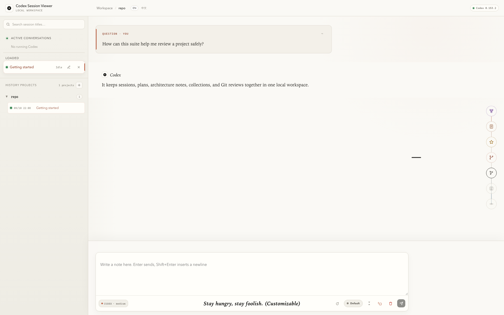
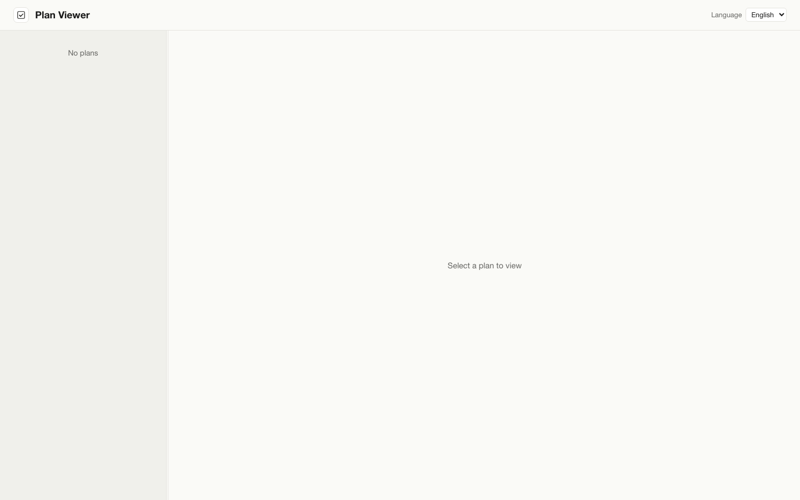
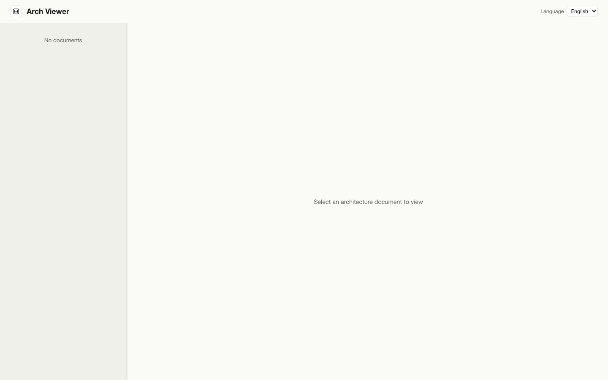
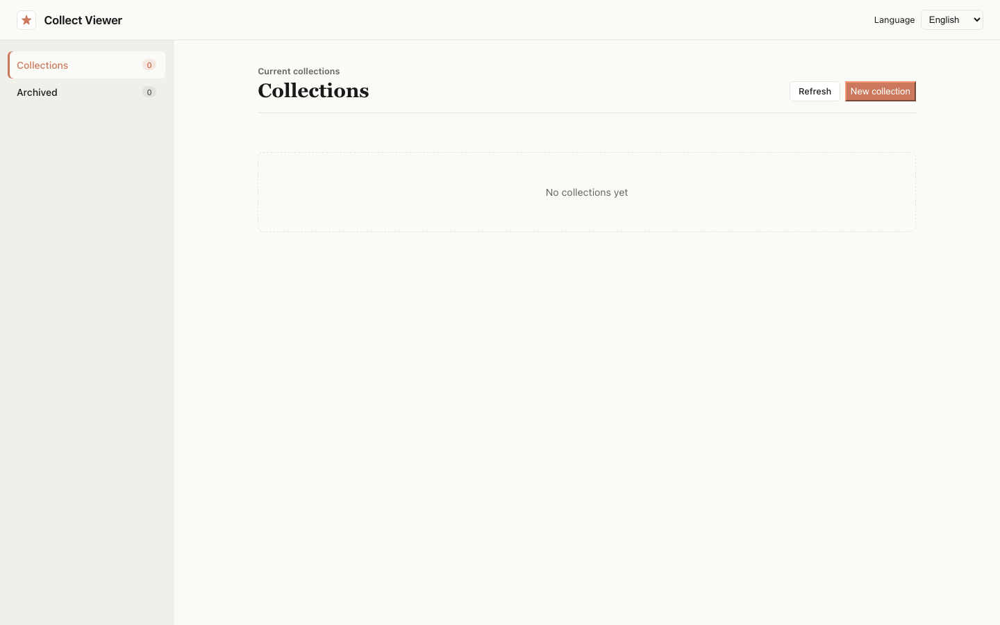
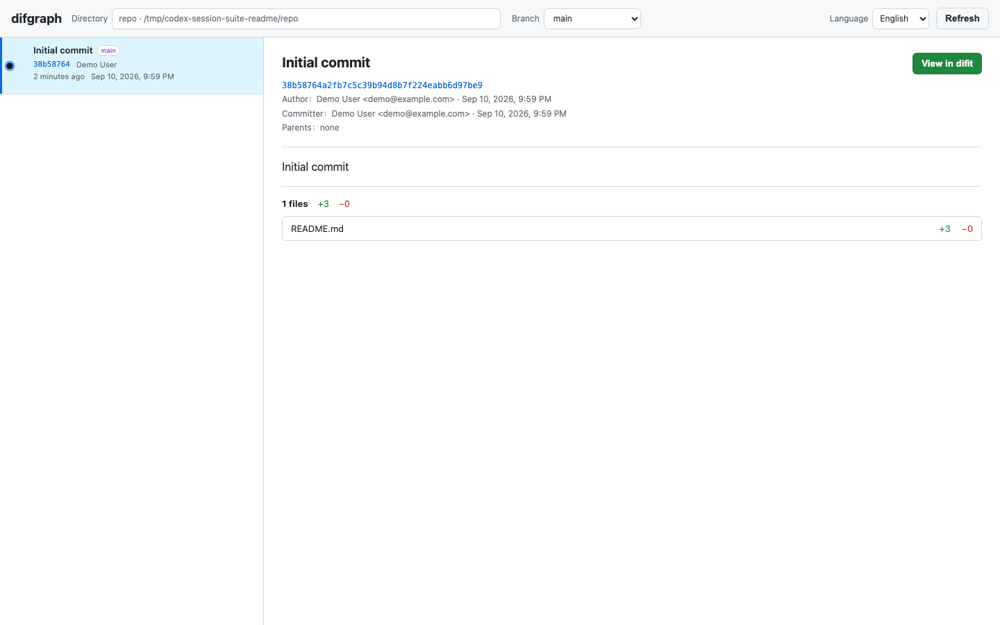
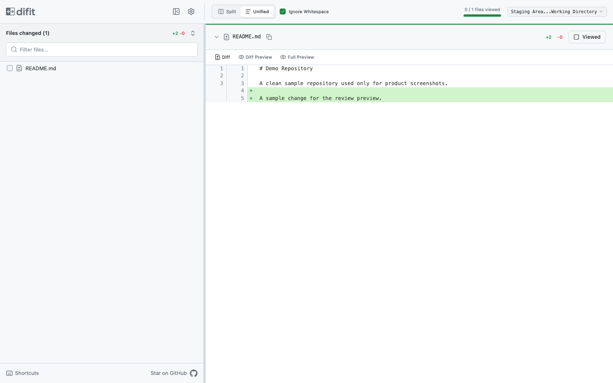

<div align="center">

# ✨ Codex Session Suite

**A local-first visual workspace for Codex conversations, plans, architecture knowledge, collections, and Git review.**

<p>
  <a href="./README.zh-CN.md">简体中文</a>
  ·
  <a href="#-quick-start">Quick start</a>
  ·
  <a href="#-workspace-preview">Screenshots</a>
  ·
  <a href="https://github.com/YWByte/codex-session-suite/issues">Issues</a>
</p>

<p>
  
  
  
  <a href="./LICENSE"></a>
</p>

</div>

Codex Session Suite brings the parts of a Codex workflow that are normally spread across terminal output, Markdown files, and Git tools into one browser workspace. A single command starts **Session**, **Plan**, **Arch**, and **Collect**; **Difgraph** and the MIT-licensed **Difit** integration are available when a repository review needs them.

> [!NOTE]
> The suite runs locally and binds its HTTP services to `127.0.0.1`. Your sessions, documents, and collections remain on your machine.

## 🧭 Choose the right view

| View | Goal | Highlights |
| --- | --- | --- |
| 💬 **Session** | Continue conversations and locate code quickly | Conversation, tool, and compaction flows; one-click VS Code source navigation; absolute paths open in their default application |
| 🗺️ **Plan** | Make implementation plans easy to review | Read, compare, annotate, edit, and organize plans before or during execution |
| 🏛️ **Arch** | Organize code and existing knowledge | Document current behavior, connect source locations, and preserve architecture or domain knowledge |
| 📚 **Collect** | Retain reusable material | Keep useful excerpts and references outside an individual conversation |
| 🌿 **Difgraph** | Understand repository relationships | Explore Git history and related changes visually |
| 🔍 **Difit** | Review diffs | Open a focused Git diff review without interrupting the conversation flow |

## 💬 Session advantages

Session is more than a transcript viewer. It turns a Codex thread into an actionable workspace for reading, organizing, continuing, and reviewing work.

| Capability | What it improves |
| --- | --- |
| 📝 **Annotations** | Select conversation content, attach a note, revisit highlighted passages, and clear annotations when they are no longer needed |
| ⭐ **One-click collection** | Save a whole message or a selected passage directly to Collect, optionally with a note, while retaining a link back to its conversation source |
| 🕘 **Fast conversation history** | Browse sessions by project, search session titles, jump between user messages, and progressively load older or larger history without losing your place |
| 🌳 **Function and session tree** | View parent threads, child threads, sub-agents, and descendant relationships; jump from a tool or sub-agent activity directly to the related thread |
| 📦 **Archive and restore** | Move completed sessions out of the active list, inspect archived conversations in read-only mode, and restore them when needed |
| 🗑️ **Batch deletion** | Select and permanently delete multiple session trees, with descendant awareness and safeguards for active child threads |
| 🧠 **Model switching** | Change the available model and reasoning effort for the current conversation without leaving Session |
| 🔀 **Conversation mode switching** | Switch between Default and Plan collaboration modes to match execution or planning work |
| ✏️ **Edit and resend history** | Edit an earlier user message and send it as a new current instruction while retaining the existing conversation context |
| 🧰 **Rich activity timeline** | Read agent messages, reasoning, plans, command output, file changes, MCP calls, sub-agent activity, approvals, and request-for-input states in one flow |
| 🗜️ **Context controls** | Monitor token usage, trigger context compaction, interrupt active work, and follow live execution state |
| 🖼️ **Image support** | Send images, preview image messages, remove pending images, and open larger previews when needed |
| 🔗 **Actionable file paths** | Open source locations in VS Code at the referenced line and column, or open other absolute paths with the system default application |
| 🌿 **Integrated Git review** | Inspect the current branch, open the commit graph in Difgraph, and review staged or committed changes in Difit |
| 🌐 **Bilingual workspace** | Use the complete Session interface in English or Simplified Chinese with a shared language preference across suite components |

## 📌 Recommended model rules

Plan and Arch can display a document only after the model writes it into the directory watched by the suite. **We strongly recommend declaring the configured Plan and Arch storage paths in your model rules (system or developer instructions).**

The default roots are:

- Plan: `~/.codex-cli/plans`
- Arch: `~/.codex-cli/arch`

If `[data].plans_dir` or `[data].arch_dir` is customized, use the configured path instead. Expand `~` and give the model a real absolute path.

Suggested rules:

```text
Save Plan documents under <absolute-path-to-plan-directory>.
Save Arch documents under <absolute-path-to-arch-directory>.
When referencing local files in a conversation, use absolute paths and include line and column positions when useful.
```

This makes generated documents discoverable by the correct viewer. It also turns source references into useful actions: a source location can jump directly to VS Code, while other absolute paths can open with the operating system's default application.

## 🚀 Quick start

### Requirements

- **Node.js 22 or newer**
- **Codex CLI 0.153.2** on `PATH`, or configured through `codex.bin` / `CODEX_BIN`
- **macOS** for the complete desktop experience, including folder selection, opening local paths, and moving documents to Trash

Other operating systems can still use conversations, documents, collections, and read-only Git features. Unsupported desktop integrations are disabled rather than replaced with destructive fallbacks.

### Install and run

```sh
npm install -g codex-session-suite
codex-session-suite doctor
codex-session-suite start
```

The default command is `start`.

```sh
codex-session-suite start --no-open
codex-session-suite start --locale zh-CN
codex-session-suite start --config /absolute/path/to/config.toml
```

| Option | Purpose |
| --- | --- |
| `--no-open` | Do not open the browser automatically |
| `--locale en\|zh-CN` | Select the interface language |
| `--config <path>` | Load a specific TOML configuration file |
| `doctor` | Validate configuration, Codex CLI availability, and version compatibility |

## 🖼️ Workspace preview

All screenshots use an isolated demo workspace. They contain no personal sessions, documents, collections, or real source repositories.

### 💬 Session

A complete conversation view with messages, input, tool activity, and code-oriented navigation.



### 🗺️ Plan

A dedicated place to browse and review implementation plans.



### 🏛️ Arch

A knowledge view for understanding existing code and architecture.



### 📚 Collect

Reusable notes and references collected across sessions.



### 🌿 Difgraph

A visual view of repository history and change relationships.



### 🔍 Difit

A focused interface for reviewing Git diffs.



## ⚙️ Configuration

Copy [`config.example.toml`](./config.example.toml) to `config.toml` in the working directory. Configuration precedence is **CLI options → environment variables → TOML → safe defaults**.

### Default services

| Service | Port |
| --- | ---: |
| Plan | `3458` |
| Arch | `3459` |
| Session | `3460` |
| Collect | `3461` |

Plans, architecture documents, and collections are stored under `CODEX_HOME` by default. Uninstalling the npm package does not remove this data. Back up configured data paths before deleting or migrating them.

## 🛣️ Current coverage and roadmap

This project currently focuses on the most common Codex experience: **conversation streams, tool streams, compaction, and the surrounding session workflow**. The Codex server protocol exposes additional `item` events that are not yet fully adapted or presented. Supporting more of those events is a primary path for future development.

> [!WARNING]
> The Codex official API and server protocol can evolve, and the current compatibility layer may contain bugs or lag behind upstream changes. A personal deployment may require AI-assisted debugging or small compatibility adjustments for the Codex version in use. If you encounter any issue, please report it freely in [GitHub Issues](https://github.com/YWByte/codex-session-suite/issues) with the Codex version, operating system, relevant logs, and reproducible steps when possible.

Contributions are welcome, especially for:

- [ ] Additional Codex server `item` event adapters and visualizations
- [ ] Compatibility fixes for new Codex API or protocol versions
- [ ] Reproducible integration fixtures and regression tests
- [ ] Cross-platform desktop integration improvements

## 🌐 Languages

The UI and CLI support **English** and **Simplified Chinese**. Resolution order is: explicit page locale or `--locale`, shared language cookie, TOML, browser/system language, then English fallback. All code comments are written in English.

## 🔐 Security model

- HTTP services accept loopback traffic only
- Unsafe cross-origin writes are rejected
- Document paths are validated before access
- TOML configuration does not accept credentials
- Codex remains an external prerequisite and is not bundled

Before publishing, run `npm run check:release`.

## 🧑‍💻 Development

```sh
npm install
npm test
npm run test:pack
npm run check:release
npm pack --dry-run
```

Please read [CONTRIBUTING.md](./CONTRIBUTING.md), [SECURITY.md](./SECURITY.md), [CODE_OF_CONDUCT.md](./CODE_OF_CONDUCT.md), and [THIRD_PARTY_NOTICES.md](./THIRD_PARTY_NOTICES.md).

## 📄 License

Released under the [MIT License](./LICENSE).
